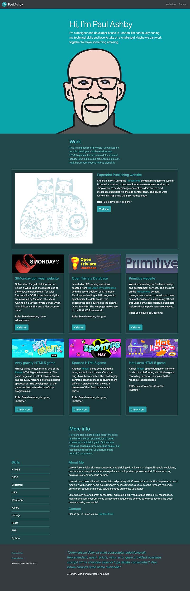

# Bootstrap-Portfolio
Personal portofio making use of the Bootstrap 4 framework

This challenge was set as part of [the Trilogy Skills Bootcamp in Front-End Web Development](https://skillsforlife.edx.org/coding/frontend/landing/?s=Google-Unbranded&pkw=web%20design%20training&pcrid=624628533241&pmt=p&utm_source=google&utm_medium=cpc&utm_campaign=GGL%7CSKILLS-FOR-LIFE%7CSEM%7CCODING%7C-%7COFL%7CTIER-1%7CALL%7CNBD-G%7CBMM%7CPrimary%7CSubject-Matter&utm_term=web%20design%20training&s=google&k=web%20design%20training&utm_adgroupid=140443158663&utm_locationphysicalms=1006886&utm_matchtype=p&utm_network=g&utm_device=c&utm_content=624628533241&utm_placement=&gclid=Cj0KCQjwqc6aBhC4ARIsAN06NmMdwBRSe3BLeaChkukN5Bbqb18220k1ku9TB2o9tzsX0xYUc-dlRWgaAuyvEALw_wcB&gclsrc=aw.ds). The project was started from a blank canvas and is likely to become an ongoing project, showcasing the work completed as part of the course alongside examples of my previous work. The brief for the project specified that the following elements should be included:

- A Navigation bar    
- A navigation menu at the top. Feel free to use bootstrap's navbar or create your own.
- links that are applicable to your portfolio.
    - Links should navigate to the appropriate sections
- A hero section:
    - A jumbotron featuring your picture, your name, and any other information you'd like to include.
- A work section
- A section displaying your work in grid. 
    - Use bootstrap cards for each project.
    - The description should give a brief overview of the work.
    - Each project will eventually link to your class project work!
- A skills section
    - List out the skills you expect to learn from the bootcamp.
- An about / contact section.
    - An "About Me" section in the same row.
- A footer section.
- All hyperlinks should have a hover effect.
- All buttons should display a box shadow upon hover.

The project has been [deployed on GitHub Pages](https://paulashby.github.io/Bootstrap-Portfolio).

## Installation

If for any reason you would like to deploy the website yourself, simply fork this repository, go to the Settings page of your fork on GitHub, select <kbd>Pages</kbd> and set the <kbd>Branch</kbd> dropdown to <kbd>main</kbd>.

## Usage

If you wish to use this layout to promote yourself or your business, you can update your forked version (see [Installation](#installation)) with your own content. Alternatively, you can visit [my deployed site](https://paulashby.github.io/Bootstrap-Portfolio) to see the page in action.

## Credits
Thanks to [the Trilogy Skills Bootcamp in Front-End Web Development](https://skillsforlife.edx.org/coding/frontend/landing/?s=Google-Unbranded&pkw=web%20design%20training&pcrid=624628533241&pmt=p&utm_source=google&utm_medium=cpc&utm_campaign=GGL%7CSKILLS-FOR-LIFE%7CSEM%7CCODING%7C-%7COFL%7CTIER-1%7CALL%7CNBD-G%7CBMM%7CPrimary%7CSubject-Matter&utm_term=web%20design%20training&s=google&k=web%20design%20training&utm_adgroupid=140443158663&utm_locationphysicalms=1006886&utm_matchtype=p&utm_network=g&utm_device=c&utm_content=624628533241&utm_placement=&gclid=Cj0KCQjwqc6aBhC4ARIsAN06NmMdwBRSe3BLeaChkukN5Bbqb18220k1ku9TB2o9tzsX0xYUc-dlRWgaAuyvEALw_wcB&gclsrc=aw.ds) for dreaming up the exercise. Thanks also to Philip Howley, the course Instructor and Brooke Love, my personal teaching assistant.

## License
Licensed under the [MIT](https://github.com/paulashby/Bootstrap-Portfolio/blob/main/LICENSE.md) license.

